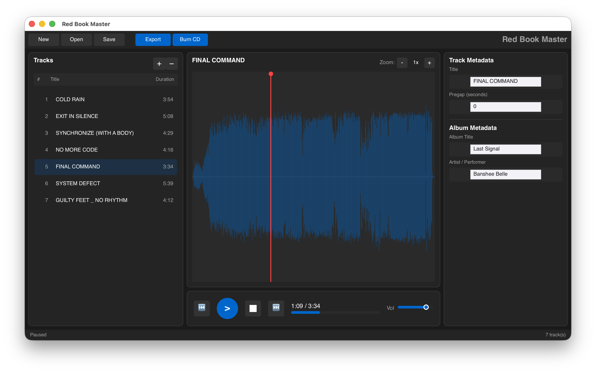
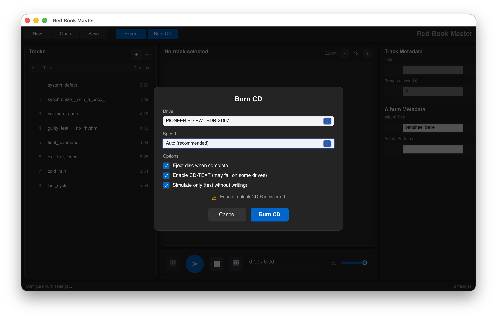
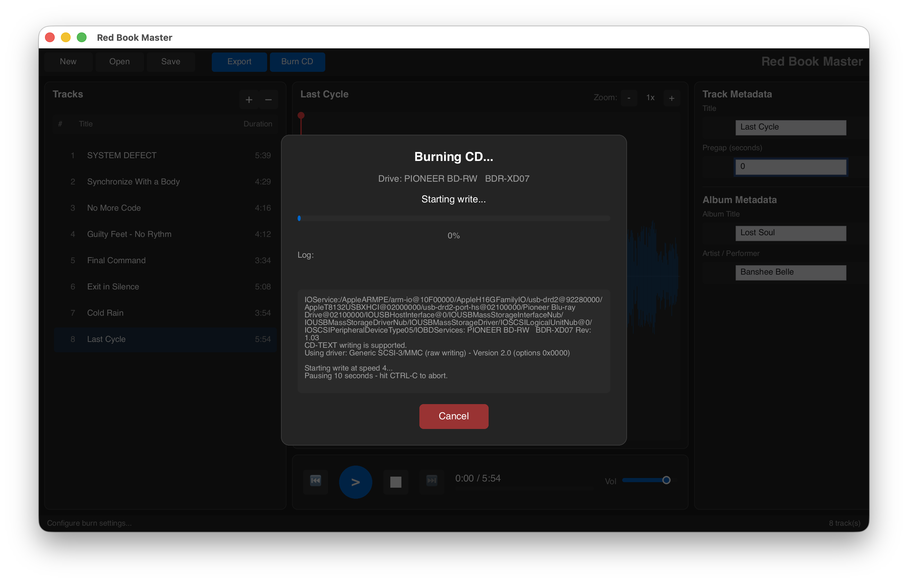
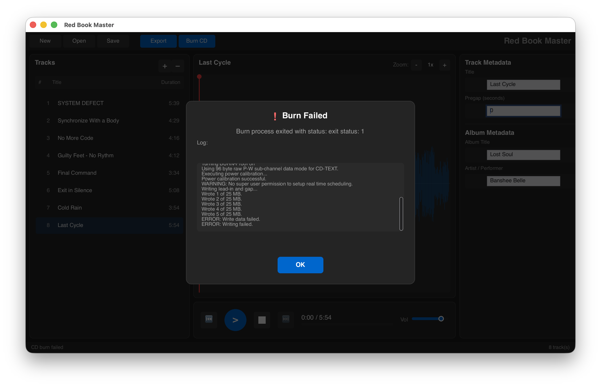

# Red Book Master

A professional tool for creating Red Book compatible CD masters with CUE sheet output. Available as both a **GUI application** and a **CLI tool**.



## Features

- **Modern GUI application** - Native desktop app with dark theme, waveform display, and intuitive controls
- **Interactive CLI wizard** - Guided step-by-step experience for creating CD masters
- **Red Book compliant** - Enforces CD-DA specifications (16-bit, 44.1kHz stereo)
- **Automatic format conversion** - Converts non-compliant WAV files (resampling, bit depth, channels)
- **Waveform visualization** - Zoomable/scrollable waveform display with playhead
- **Audio preview** - Play tracks with real-time position tracking
- **Full metadata support** - CD-TEXT, ISRC codes, MCN/UPC catalog numbers
- **CUE sheet export** - Industry-standard format for CD mastering
- **TOC file export** - Compatible with cdrdao for disc-at-once burning
- **CD burning** - Direct burning via cdrdao with progress display and CD-TEXT support
- **Project files** - Save and load projects in .rbm format
- **Drag & drop track reordering** - Easily arrange tracks in the GUI

## GUI Application

The GUI provides a professional desktop experience for CD mastering:

### Main Features

- **Track List Panel** - View and manage tracks with number, title, duration, pregap, and postgap
- **Waveform View** - Zoomable waveform display for the selected track with playhead
- **Metadata Editor** - Edit track and album metadata in real-time
- **Playback Controls** - Play, pause, stop, previous/next track, volume control
- **Menu Bar** - Quick access to New, Open, Save, Export, and Burn CD

### CD Burning Dialog

The burn dialog provides a complete burning experience:



- **Drive Selection** - Choose from detected CD/DVD drives
- **Speed Selection** - Auto, 1x, 2x, 4x, 8x, 16x, 24x, 48x
- **Options** - Eject disc, Enable CD-TEXT, Simulate only
- **Real-time Progress** - Progress bar with MB written percentage



- **Live Log Output** - See cdrdao output in real-time
- **Cancel Support** - Abort burning if needed (disc may be unusable)



- **Error Details** - Full log preserved for debugging when errors occur

### Keyboard Shortcuts

| Shortcut | Action |
|----------|--------|
| ⌘+N | New project |
| ⌘+O | Open project |
| ⌘+S | Save project |
| ⌘+Shift+S | Save As |
| Space | Play/Pause |
| Escape | Stop playback |
| ↑/↓ | Select previous/next track |
| ←/→ | Previous/Next track |
| Delete | Remove selected track |

## Installation

### Prerequisites

- Rust 1.70 or later
- Audio output device (for playback features)
- cdrdao (optional, for CD burning)

### Build from source

```bash
git clone https://github.com/webmatze/redbookmaster.git
cd redbookmaster
cargo build --release
```

Binaries will be at:
- `target/release/redbookmaster` - CLI application
- `target/release/redbookmaster-gui` - GUI application

### Install via Cargo

```bash
# Install both CLI and GUI
cargo install --path crates/redbookmaster-cli
cargo install --path crates/redbookmaster-gui
```

### Run the GUI

```bash
# From the repository
cargo run -p redbookmaster-gui

# Or after installation
redbookmaster-gui
```

### Run the CLI

```bash
# From the repository
cargo run -p redbookmaster

# Or after installation
redbookmaster
```

## Project Structure

The repository is organized as a Cargo workspace:

```
redbookmaster/
├── crates/
│   ├── redbookmaster-lib/    # Shared library (core, audio, export, burn)
│   ├── redbookmaster-cli/    # CLI application
│   └── redbookmaster-gui/    # GUI application (Slint)
├── screenshots/              # Application screenshots
└── README.md
```

## CLI Usage

### Interactive Mode (Recommended)

Launch the interactive wizard:

```bash
redbookmaster
```

This opens a guided menu where you can:
- Create new projects
- Add and manage tracks
- Edit metadata (album, track, ISRC, MCN)
- Configure track gaps
- Preview audio playback
- Export master files
- Burn CDs

### Command Line

```bash
# Create a new project
redbookmaster new

# Open an existing project
redbookmaster open my-album.rbm

# Add tracks to current project
redbookmaster add track1.wav track2.wav

# List tracks
redbookmaster list

# Edit track metadata
redbookmaster edit 1

# Reorder tracks
redbookmaster reorder

# Configure track gaps
redbookmaster gaps

# Play album preview
redbookmaster play

# Play specific track
redbookmaster play 3

# Play transition between tracks
redbookmaster transition 2

# Validate Red Book compliance
redbookmaster validate

# Export CUE/WAV master
redbookmaster export

# Burn to CD (requires cdrdao)
redbookmaster burn

# Show project info
redbookmaster info
```

## Workflow Example

### GUI Workflow

1. Click **New** to create a project (choose location and name)
2. Click **Add Tracks** to add WAV files
3. Non-compliant files are automatically detected and can be transcoded
4. Edit track/album metadata in the right panel
5. Drag tracks to reorder them
6. Use playback controls to preview
7. Click **Export** to generate master WAV, CUE, and TOC files
8. Click **Burn CD** to open the burn dialog and write to disc

### CLI Workflow

```
$ redbookmaster

Welcome to Red Book Master!

? What would you like to do?
> Create new project

? Album title: My Awesome Album
? Artist/Performer: The Band
? Add WAV files now? Yes
? WAV file path: /path/to/track1.wav
✓ Added: Track 1 (3:42)
? WAV file path: /path/to/track2.wav
⚠ File is not Red Book compliant: Sample rate is 48000Hz (need 44100Hz)
? What would you like to do?
> Convert automatically
⟳ Converting to Red Book format...
✓ Conversion complete: 48000Hz -> 44100Hz
✓ Added: Track 2 (4:15)

? Save project as: my-awesome-album.rbm
✓ Project saved
```

## Audio Format Conversion

Red Book Master automatically handles non-compliant WAV files:

| Input Format | Conversion |
|--------------|------------|
| 48kHz, 96kHz, etc. | Resampled to 44.1kHz (high-quality FFT resampling) |
| 24-bit, 32-bit | Converted to 16-bit with TPDF dithering |
| Mono | Duplicated to stereo |
| 32-bit float | Converted to 16-bit integer |

## Red Book Specifications

The tool enforces the following CD-DA (Red Book) specifications:

| Specification | Requirement |
|---------------|-------------|
| Audio format | 16-bit, 44.1kHz, stereo PCM |
| Maximum tracks | 99 |
| Maximum duration | 79:57 |
| Minimum track duration | 4 seconds |
| Track 1 pregap | 2 seconds (default) |
| ISRC format | CC-XXX-YY-NNNNN (country-registrant-year-designation) |
| MCN format | 13 digits (UPC/EAN with check digit) |

## Project Files

Projects are saved as `.rbm` files (JSON format) in a project directory:

```
MyAlbum_rbm/
├── MyAlbum.rbm           # Project file (JSON)
├── _transcoded/          # Converted files (if any)
│   └── 01_track.wav
├── myalbum.wav           # Master WAV (after export)
├── myalbum.cue           # CUE sheet
└── myalbum.toc           # TOC file for cdrdao
```

Project files contain:
- Album metadata (title, performer, songwriter, catalog number)
- Track list with individual metadata (title, performer, ISRC)
- Gap configurations (pregap, postgap per track)
- CD-TEXT information

## Output Formats

### Single WAV + CUE (Recommended)

Concatenates all tracks into a single WAV file with proper gaps, plus:
- `.cue` - CUE sheet with CD-TEXT
- `.toc` - cdrdao TOC file for burning

Best for CD burning and replication.

### Multi-file CUE

Generates a CUE sheet referencing original WAV files. Useful for software playback but requires all source files to be present.

## External Dependencies

### cdrdao (for CD burning)

cdrdao is required only for the "Burn CD" feature.

```bash
# macOS (Homebrew)
brew install cdrdao

# Ubuntu/Debian
sudo apt install cdrdao

# Fedora
sudo dnf install cdrdao

# Arch Linux
sudo pacman -S cdrdao
```

Red Book Master automatically searches for cdrdao in:
- System PATH
- `/opt/homebrew/bin/cdrdao` (Homebrew on Apple Silicon)
- `/usr/local/bin/cdrdao` (Homebrew on Intel Mac)
- `/usr/bin/cdrdao` (Linux)

## Rust Dependencies

| Crate | Purpose |
|-------|---------|
| slint | GUI framework (GUI only) |
| clap | Command-line argument parsing (CLI only) |
| inquire | Interactive prompts and menus (CLI only) |
| hound | WAV file reading and writing |
| rodio | Audio playback |
| rubato | High-quality audio resampling |
| rfd | Native file dialogs |
| serde / serde_json | Project file serialization |
| dirs | User preferences directory |
| colored | Terminal colors (CLI only) |
| thiserror | Error handling |
| chrono | Timestamps |
| indicatif | Progress bars (CLI only) |

## Tips

1. **Use lower burn speeds** - 4x or 8x is recommended for audio CDs
2. **Simulate first** - Use the "Simulate only" option before actual burning
3. **Check track gaps** - Default is 2s for track 1, 0 for others
4. **Preview playback** - Listen to tracks before exporting
5. **Export before burning** - The burn dialog requires an exported TOC file
6. **CD-TEXT compatibility** - Some drives don't support CD-TEXT; disable if burning fails

## Troubleshooting

### "cdrdao is not installed"

Even if cdrdao is in your PATH, the program searches specific locations. Install via Homebrew on macOS or your system package manager on Linux.

### Audio playback not working

Ensure you have a working audio output device. The program uses the system default audio output.

### Conversion taking too long

Large files (especially high sample rates) take longer to convert. The FFT-based resampler prioritizes quality over speed.

### CD-TEXT burning fails

Some drives don't support CD-TEXT with the `--driver generic-mmc-raw` option. Disable the "Enable CD-TEXT" option in the burn dialog and try again.

### GUI window size not saving

Window size is saved to `~/Library/Application Support/redbookmaster/preferences.json` on macOS. Delete this file to reset preferences.

## License

This software is licensed under a **Personal Use License**. You are free to use, modify, and share the software for personal, educational, or internal business purposes at no cost.

**You may NOT** sell, commercially distribute, or bundle this software with paid products.

For commercial licensing inquiries, contact: mathias.karstaedt@gmail.com

See the [LICENSE](LICENSE) file for full terms.

## Contributing

Contributions are welcome! Please feel free to submit issues and pull requests.

## Acknowledgments

- [Slint](https://slint.dev/) - Modern GUI framework
- [hound](https://github.com/ruuda/hound) - WAV file handling
- [rodio](https://github.com/RustAudio/rodio) - Audio playback
- [rubato](https://github.com/HEnquist/rubato) - High-quality resampling
- [cdrdao](http://cdrdao.sourceforge.net/) - CD burning
